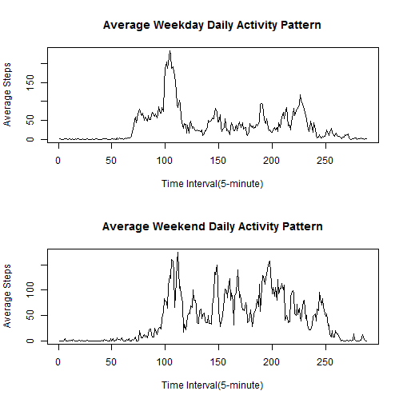

## Overview
This report is for Reproducible Research assignment I. I will answer questions mentioned in the assignment as mentioned below one by one. 

## Data
Activity monitoring dataset is available here:     
(https://d396qusza40orc.cloudfront.net/repdata%2Fdata%2Factivity.zip)      
The variables included in this dataset are:     
a. steps: Number of steps taking in a 5-minute interval (missing values are coded as NA)   
b. date: The date on which the measurement was taken in YYYY-MM-DD format     
c. interval: Identifier for the 5-minute interval in which measurement was taken    

## Loading and preprocessing the data   
a. Show any code that is needed to Load the data.  

```r
# Assume that file activity.csv is in the working directory
setwd("D:/Coursera/05_RR/Project 1")
activity <- read.csv("data/activity.csv")
```

b. Process/transform the data into a format suitable for your analysis  

```r
# Load package dplyr
library(dplyr)
# Transform data frame activity into a tbl data frame
activity <- tbl_df(activity)
```

---------------------------------

## What is mean total number of steps taken per day?

For this part of the assignment, you can ignore the missing values in the dataset.

a. Calculate the total number of steps taken per day

```r
tot_steps <- sapply(split(activity$steps,activity$date),sum)
```

b. Make a histogram of the total number of steps taken each day

```r
hist(tot_steps, xlab = "Steps", ylab = "Frequency (days)", main = "Histogram of total steps taken each day",breaks = seq(0,(floor(max(tot_steps,na.rm=TRUE)/1000)+1)*1000,1000))
```

 

c. Calculate and report the mean and median of the total number of steps taken per day

```r
# The mean of the total number of steps taken per day
 mean(tot_steps, na.rm = TRUE)
```

```
## [1] 10766.19
```

```r
# The median of the total number of steps taken per day
 median(tot_steps, na.rm = TRUE)
```

```
## [1] 10765
```

## What is the average daily activity pattern?

a. Make a time series plot (i.e. type = "l") of the 5-minute interval (x-axis) and the average number of steps taken, averaged across all days (y-axis)

```r
# Calculate avg_steps by time interval
 avg_steps <- tapply(activity$steps, activity$interval, mean, na.rm=TRUE)
# Make a plot of average steps by 288 five-minute intervals
 plot(x = 1:288, y = avg_steps, type = "l", xlab = "Time Interval(5-minute)", ylab = "Average Steps", main = "Average Daily Activity Pattern")
```

 


b. Which 5-minute interval, on average across all the days in the dataset, contains the maximum number of steps?

```r
# Find maximun avg_steps across all the days 
 match(max(avg_steps),avg_steps)
```

```
## [1] 104
```

```r
 avg_steps[match(max(avg_steps),avg_steps)]
```

```
##      835 
## 206.1698
```

The 104th 5-minutes interval of the day, from 8:35 to 8:40, has the maximum number of steps. 

## Imputing missing values

Note that there are a number of days/intervals where there are missing values (coded as NA). The presence of missing days may introduce bias into some calculations or summaries of the data.

a. Calculate and report the total number of missing values in the dataset (i.e. the total number of rows with NAs)

```r
 summary(activity)
```

```
##      steps                date          interval     
##  Min.   :  0.00   2012-10-01:  288   Min.   :   0.0  
##  1st Qu.:  0.00   2012-10-02:  288   1st Qu.: 588.8  
##  Median :  0.00   2012-10-03:  288   Median :1177.5  
##  Mean   : 37.38   2012-10-04:  288   Mean   :1177.5  
##  3rd Qu.: 12.00   2012-10-05:  288   3rd Qu.:1766.2  
##  Max.   :806.00   2012-10-06:  288   Max.   :2355.0  
##  NA's   :2304     (Other)   :15840
```
There are 2304 NA's.

b. Devise a strategy for filling in all of the missing values in the dataset.   

I am going to use the mean for that 5-minute interval to fill in the missing values.  

c. Create a new dataset that is equal to the original dataset but with the missing data filled in.

```r
 activity_filled <- activity
 miss <- is.na(activity_filled$steps)

 # auxiliary data frame int_avg
 interval <- activity$interval[1:288]
 aux <- as.data.frame(cbind(interval,avg_steps),row.names = FALSE)

 for (i in 1:length(miss) ){
   if (miss[i] == TRUE){
      # find corresponding interval
      time <- activity_filled$interval[i]
      posi <- match(time, aux$interval)
      # fill the mean for that 5-minute interval into NA columns
      activity_filled$steps[i] <- avg_steps[posi]
   }
 }
```

d. Make a histogram of the total number of steps taken each day and Calculate and report the mean and median total number of steps taken per day. Do these values differ from the estimates from the first part of the assignment? What is the impact of imputing missing data on the estimates of the total daily number of steps? 


```r
# Similar to the code above, change tot_steps to tot_steps_filled    
tot_steps_filled <- tapply(activity_filled$steps, activity_filled$date, sum)
print(tot_steps_filled)
```

```
## 2012-10-01 2012-10-02 2012-10-03 2012-10-04 2012-10-05 2012-10-06 
##   10766.19     126.00   11352.00   12116.00   13294.00   15420.00 
## 2012-10-07 2012-10-08 2012-10-09 2012-10-10 2012-10-11 2012-10-12 
##   11015.00   10766.19   12811.00    9900.00   10304.00   17382.00 
## 2012-10-13 2012-10-14 2012-10-15 2012-10-16 2012-10-17 2012-10-18 
##   12426.00   15098.00   10139.00   15084.00   13452.00   10056.00 
## 2012-10-19 2012-10-20 2012-10-21 2012-10-22 2012-10-23 2012-10-24 
##   11829.00   10395.00    8821.00   13460.00    8918.00    8355.00 
## 2012-10-25 2012-10-26 2012-10-27 2012-10-28 2012-10-29 2012-10-30 
##    2492.00    6778.00   10119.00   11458.00    5018.00    9819.00 
## 2012-10-31 2012-11-01 2012-11-02 2012-11-03 2012-11-04 2012-11-05 
##   15414.00   10766.19   10600.00   10571.00   10766.19   10439.00 
## 2012-11-06 2012-11-07 2012-11-08 2012-11-09 2012-11-10 2012-11-11 
##    8334.00   12883.00    3219.00   10766.19   10766.19   12608.00 
## 2012-11-12 2012-11-13 2012-11-14 2012-11-15 2012-11-16 2012-11-17 
##   10765.00    7336.00   10766.19      41.00    5441.00   14339.00 
## 2012-11-18 2012-11-19 2012-11-20 2012-11-21 2012-11-22 2012-11-23 
##   15110.00    8841.00    4472.00   12787.00   20427.00   21194.00 
## 2012-11-24 2012-11-25 2012-11-26 2012-11-27 2012-11-28 2012-11-29 
##   14478.00   11834.00   11162.00   13646.00   10183.00    7047.00 
## 2012-11-30 
##   10766.19
```

```r
# Draw the graph
hist(tot_steps_filled, xlab = "Steps",ylab = "Frequency(days)", main = "Histogram of total steps taken each day (with filled data)",breaks = seq(0,(floor(max(tot_steps,na.rm=TRUE)/1000)+1)*1000,1000))
```

 

```r
# The mean and median total number of steps taken per day (with filled dataset)
 mean(tot_steps_filled)
```

```
## [1] 10766.19
```

```r
 median(tot_steps_filled)
```

```
## [1] 10766.19
```

After imputing missing data on the estimates of the total daily number of steps, the mean and median didn't change much.

## Are there differences in activity patterns between weekdays and weekends?

For this part the weekdays() function may be of some help here. Use the dataset with the filled-in missing values for this part.

a. Create a new factor variable in the dataset with two levels – “weekday” and “weekend” indicating whether a given date is a weekday or weekend day.

```r
 activity <- mutate(activity, week = weekdays(as.POSIXct(activity$date)))

 for (i in 1:length(activity$week)) {
   if (activity$week[i] == "Saturday"){
      activity$week[i] <- "weekend"
   }else if(activity$week[i] == "Sunday"){
      activity$week[i] <- "weekend"
   }else{
      activity$week[i] <- "weekday"
   }
}
```


b. Make a panel plot containing a time series plot (i.e. type = "l") of the 5-minute interval (x-axis) and the average number of steps taken, averaged across all weekday days or weekend days (y-axis).

```r
par(mfrow=c(2,1))

# Weekday data
act_weekday <- filter(activity, week == "weekday")
avg_steps_weekday <- tapply(act_weekday$steps, act_weekday$interval, mean, na.rm=TRUE)

# Weekend data
act_weekend <- filter(activity, week == "weekend")
avg_steps_weekend <- tapply(act_weekend$steps, act_weekend$interval, mean, na.rm=TRUE)

# Draw the graph
plot(x = 1:288, y = avg_steps_weekday, type = "l", xlab = "Time Interval(5-minute)", ylab = "Average Steps", main = "Average Weekday Daily Activity Pattern")

plot(x = 1:288, y = avg_steps_weekend, type = "l", xlab = "Time Interval(5-minute)", ylab = "Average Steps", main = "Average Weekend Daily Activity Pattern")
```

 
